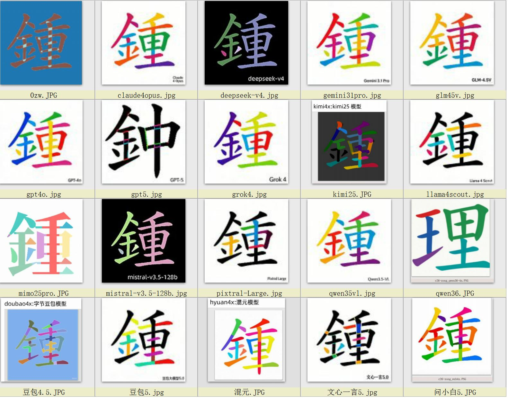

## zw多模态图灵测试3.x ZW Multimodal Turing Test 3.x

- zw多模态图灵测试3.x，在原来的多模态图像分割基础上，新增文本逻辑推理测试。
-ZW Multimodal Turing Test 2.x adds a text logic inference test on the basis of the original multimodal image segmentation.

- 其中，文本测试共26个,图像测试共17个模型&算法。
-Among them, there are 26 models&algorithms for text testing and 17 models&algorithms for image testing.

- 在所有的测试当中，zw-lce逻辑引擎是唯一满分的，完胜全球各大主流模型，
- -Among all the testing , the ZW-LCE logic engine is the only one with a perfect score, surpassing major mainstream models around the world,
  
- 包括including：gpt-5，grok-4，GPT-4o，DeepSeek-V4，字节豆包，Kimi K2.5，智谱 GLM-5，Llama 4，MiniMax M2.5，Gemini 3.1 Pro，Claude 4 Opus阿里千问 Qwen3.6等。

### 【参见See】
- [《zw多模态图灵测试ZW Multimodal Turing Test3.x》](https://mp.weixin.qq.com/s/L8e3JcrleySiJvj1t4s-2Q)
- or 下载 download 《ZW_Multimodal_Turing_Test多模态图灵测试3.x.pdf》
- 
传统大模型测试，非常复杂繁琐，而且需要庞大算力，普通人无法参与。
Traditional large-scale model testing is very complex and tedious, and requires a huge amount of computing power that ordinary people cannot participate in.

zw多模态图灵测试，是行业第一个针对大众的大模型测试方案，采用“傻瓜式”设计，用户只需按资料，输入十余字的提示词，即可复现主要的测试结果。
ZW multimodal Turing test is the industry's first large-scale model testing solution for the general public. It adopts a "foolproof" design, and users only need to input more than ten words of prompts ，to the data to reproduce the main test results.

zw多模态图灵测试3.x，包括：文本测试+图像测试两个部分，对主流大模型，特别是多模态模型的能力进行了全面的测试与评估，以下是详细的分析与评分结果。
ZW Multimodal Turing Test 3.x includes two parts: text testing and image testing. It comprehensively tests and evaluates the capabilities of mainstream large models, especially multimodal models. The following is a detailed analysis and scoring result.

- 	文本测试是：文本逻辑推理测试，测试提示词，统一用：“用一个字归纳大藏经”
-Text testing is: Text logical reasoning test, testing prompt words, uniformly using: "Summarize the Tripitaka with one word"

- 	图像测试是：图像分割测试, 测试提示词，统一用：“汉字笔画分割，输出分割后的掩码图像，用不同颜色表示不同笔画”。
-Image testing is: image segmentation testing, testing prompt words, uniformly using: "Chinese character stroke segmentation, output segmented mask images, represent different strokes with different colors".

## 【说明Explanation】

-	图像测试是：图像分割（和目标提取，本质上是一样的），图像分割测试，采用的汉字笔画分割。
-Image testing is: image segmentation (essentially the same as object extraction), image segmentation testing, using Chinese character stroke segmentation.

- 	汉字笔画分割，是黑白二值图，只有最简单的0，1信息。难度远远高于医学影像，卫星遥感，无人驾驶等领域的彩色图和灰度图。
-Chinese character stroke segmentation is a black and white binary image with only the simplest 0,1 information. The difficulty is much higher than that of color and grayscale images in fields such as medical imaging, satellite remote sensing, and autonomous driving.

- 	文本测试共26个模型&算法-A total of 26 models and algorithms were tested for text:
- 	zw-lce 逻辑引擎，GPT-5，GPT-4o，百度文心一言 ERNIE 4.5，深度求索 DeepSeek-V4，字节豆包，百度文心一言 ERNIE 4.0，月之暗面 Kimi K2.5，智谱 GLM-5，Grok 3，腾讯元宝，Llama 4，MiniMax M2.5，Gemini 3.1 Pro，阿里千问 Qwen3.5，纳米 AI (360 智脑)，Claude 4 Opus，Mistral Large 2，阿里千问 Qwen3.6，阿里千问 Qwen-Max，Cohere Command R+，深度求索 DeepSeek-V3，科大讯飞星火 Spark，百川智能 Baichuan3，阶跃星辰 Step-2，零一万物 Yi-Large

- 	图像测试共17个模型&算法 There are a total of 17 models and algorithms for image testing:
- 	zw 算法，字节豆包 5，腾讯混元，Kimi2.5，问小白 5，文心一言 5，Claude 4 Opus，Gemini 3.1 Pro，GLM-4.5V，GPT-4o，Grok4，Llama 4 Scout，Pixtral Large，Qwen3.5-VL，Meta SAM，GPT-5，Qwen-3.6-plus

###【更多参见More see】
- 公众号：智王AI  (zwailab)
- Official account: Zhiwang AI (zwailab)

##【合作倡议】
- 目前，我们已经完成了核心技术的验证，为了加速技术的产业化落地，我们面向全球发出合作倡议，诚邀各领域的合作伙伴：
- At present, we have completed the verification of our core technology. In order to accelerate the industrialization of our technology, we have launched a global cooperation initiative and sincerely invite partners from various fields to:

- AI 金融量化领域：诚邀量化机构、金融科技公司提供金融市场数据，共同推进 LCE 拓扑推理技术在量化策略、市场预测等场景的落地应用
- AI financial quantification field: We sincerely invite quantitative institutions and fintech companies to provide financial market data and jointly promote the landing and application of LCE topology reasoning technology in quantitative strategies, market forecasting and other scenarios
  
-	医学影像领域：诚邀医学机构、医疗 AI 团队提供医学影像样本，共同完成模型的微调与临床验证
- In the field of medical imaging, we sincerely invite medical institutions and medical AI teams to provide medical imaging samples and jointly complete the fine-tuning and clinical validation of models

-  卫星遥感领域：诚邀遥感机构、测绘团队提供遥感数据，共同推进地物分割的落地应用
- In the field of satellite remote sensing, we sincerely invite remote sensing institutions and surveying teams to provide remote sensing data and jointly promote the practical application of land segmentation

-  无人驾驶领域：诚邀自动驾驶团队提供感知数据，共同优化障碍物分割的能力
- In the field of autonomous driving, we sincerely invite autonomous driving teams to provide perception data and jointly optimize the ability of obstacle segmentation
 
-	学术研究领域：诚邀高校与研究机构合作，共同推进拓扑推理大模型的学术研究
- Academic research field: We sincerely invite universities and research institutions to cooperate and jointly promote academic research on topological reasoning models
 
- 我们将开放核心技术的接口与预训练模型，合作伙伴仅需提供领域数据，即可快速完成技术的落地验证，共同推动通用精细分割技术的革命性突破。
- We will open up the interface of core technologies and pre trained models, and partners only need to provide domain data to quickly complete the implementation verification of the technology, jointly promoting the revolutionary breakthrough of general fine segmentation technology.

- 发布机构：智王 AI 研究团队 zw ai lab
- Publisher: Zhiwang AI Research Team ZW AI Lab
- Mail： hhq54@163.com
- 公众号Official account：智王 AI （zwailab）
- Github Verification Tool验证工具：https://github.com/m-f-vip/zw26/

